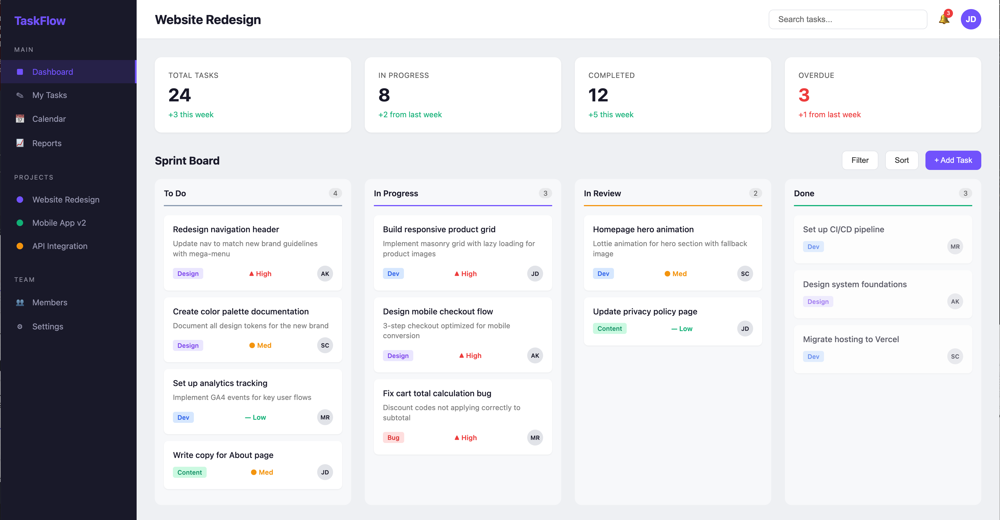
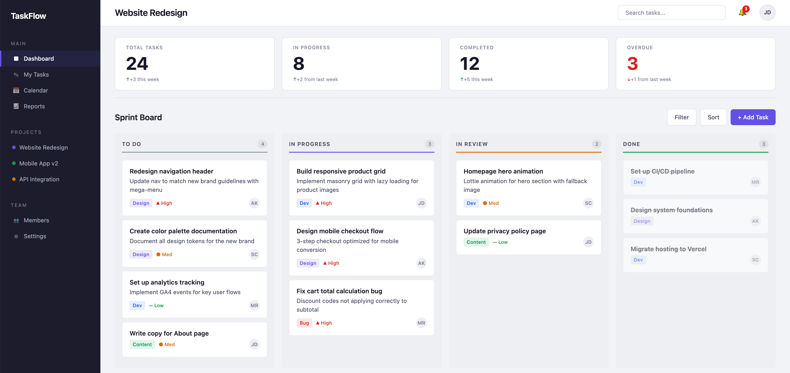

# Frontend Design Audit

A Claude Code skill that audits and improves the usability of existing front-end interfaces. It evaluates your UI code against 15 established design principles, identifies problems, rates severity, and helps fix what it finds.

## What It Does

Think of it as a Senior UX Engineer/Designer reviewing your interface end-to-end. It inspects HTML, CSS, JavaScript, React, Vue, Svelte — any front-end code — and produces a structured audit report with:

- **Findings** rated on a 0–4 severity scale (catastrophe → cosmetic)
- **Principle references** linking each issue to established usability research
- **Concrete fixes** with code-level detail, not vague suggestions
- **Strengths** — what your interface already does well

Then it implements the fixes: accessibility attributes, semantic HTML, visual hierarchy improvements, design system extraction, interaction patterns, and more.

## The 15 Principles

| # | Principle | Examples of What It Catches |
|---|-----------|----------------|
| 1 | Visibility of System Status | Missing loading states, no feedback on actions |
| 2 | Match Between System and Real World | Jargon, unintuitive labels, wrong mental models |
| 3 | User Control and Freedom | No undo, no escape, no back button |
| 4 | Consistency and Standards | Inconsistent patterns across pages |
| 5 | Error Prevention | Missing validation, no confirmation for destructive actions |
| 6 | Recognition Over Recall | Empty states, missing breadcrumbs, hidden options |
| 7 | Flexibility and Efficiency | No keyboard shortcuts, no power-user paths |
| 8 | Aesthetic and Minimalist Design | Flat typography, poor spacing, visual clutter |
| 9 | Error Recovery | Unhelpful error messages, no recovery guidance |
| 10 | Help and Documentation | Missing onboarding, no contextual help |
| 11 | Affordances and Signifiers | Unclear clickability, flat button hierarchy |
| 12 | Structure | Poor grouping, weak section boundaries |
| 13 | Accessibility | Missing alt text, no focus indicators, poor contrast |
| 14 | Perceptibility | Low contrast, invisible state changes |
| 15 | Tolerance and Forgiveness | Data loss on error, inflexible inputs |

## Installation

### Recommended: Plugin Marketplace (one-time setup, works across all projects)

1. Start Claude Code in any project:

```bash
cd your-project
claude
```

2. Add the marketplace:

```
/plugin marketplace add mistyhx/frontend-design-audit
```

3. Open the plugin menu:

```
/plugin menu
```

4. Select and install `frontend-design-audit` from the list.

5. Restart Claude Code.

### Alternative: Load Directly (per-session)

Clone this repo, then start Claude Code from your project with a relative path to the plugin:

```bash
git clone https://github.com/mistyhx/frontend-design-audit.git ~/plugins/frontend-design-audit
cd your-project
claude --plugin-dir ../plugins/frontend-design-audit
```

Or use an absolute path:

```bash
claude --plugin-dir ~/plugins/frontend-design-audit
```

## Usage

### Full Audit (default)

Evaluates your UI, presents a report, discusses findings with you, then implements fixes:

```
/frontend-design-audit
```

### Evaluate Only

Produces the audit report without implementing changes:

```
/frontend-design-audit:evaluate
/frontend-design-audit:evaluate src/pages/
/frontend-design-audit:evaluate App.tsx
```

### Improve

Implements fixes from a previous evaluation, discussing each change:

```
/frontend-design-audit:improve
```

### Quick Mode

Auto-evaluates and fixes without discussion — good for rapid iteration:

```
/frontend-design-audit:quick
/frontend-design-audit:quick src/components/Dashboard.tsx
```

### Live Website Audit

Pass a URL to audit a live site (report only — no code changes):

```
/frontend-design-audit https://example.com
```

## Example

Here's a task management dashboard before and after the audit — the skill identified and fixed issues with visual hierarchy, spacing, accessibility, and consistency:

**Before**



**After**



### What Changed

The original dashboard had solid bones — working drag-and-drop, a modal with focus trapping, responsive layout. But the audit found 22 issues across accessibility, visual hierarchy, and interaction design. Key improvements:

**Design system extraction** — Replaced 40+ hardcoded values (colors, spacing, font sizes) with CSS custom properties. One spacing scale, one type scale, one color palette used consistently across every component.

**Visual hierarchy** — Stat card numbers grew from `2rem` to `2.5rem` with labels shrunk to micro-size uppercase, creating a clear "big number, small label" dashboard pattern. Column headers differentiated from task titles via uppercase + letter-spacing. Section spacing went from uniform 1-2rem to a deliberate hierarchy (tight within cards, generous between sections).

**Accessibility** — Added skip navigation, `aria-current="page"` on active nav with visible highlight, `aria-label` on sidebar nav lists, keyboard-navigable dropdown menus (Arrow keys, Escape), keyboard task movement between columns (not just drag-and-drop), inline form validation with `aria-invalid`, and proper `<time>` elements.

**Interaction polish** — Buttons gained `:active` pressed states and `:disabled` styling. Activity feed dots replaced with distinct icons (checkmark, arrow, speech bubble) so category isn't color-only. Completed tasks use a CSS class instead of inline `opacity`.

The `examples/` directory contains more before/after pairs:

| Site | Before | After | Report |
|------|--------|-------|--------|
| Coffee shop landing page | `coffee-shop.html` | `coffee-shop-improved.html` | `reports/coffee-shop-report.md` |
| SaaS pricing page | `saas-pricing.html` | `saas-pricing-improved.html` | `reports/saas-pricing-report.md` |
| Task dashboard | `task-dashboard.html` | `task-dashboard-improved.html` | `reports/task-dashboard-report.md` |

Open any pair in a browser to see the difference.

## How It Works

The skill follows a structured workflow:

1. **Discover** — Reads your front-end code and identifies the interface type, tech stack, and user flows
2. **Evaluate** — Systematically inspects against all 15 principles, checking component-level, system-level, and visual design issues
3. **Report** — Presents findings in a structured format with severity ratings, principle references, and actionable fixes
4. **Implement** — Establishes a design foundation (CSS tokens), applies fixes through that system, then runs a coherence pass to ensure everything holds together
5. **Verify** — Post-implementation review to catch issues that fixes introduced

## License

MIT
