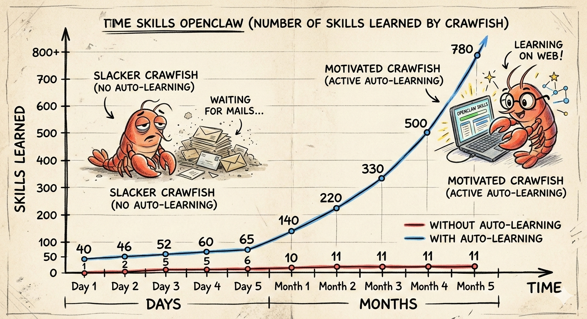

# 🚀 别让你的龙虾再偷懒了，让它自己学起来！

**让 AI 自己学会寻找和掌握新技能** —— 自动发现全球最热门的高质量 AI 技能，一键安装到你的 OpenClaw，持续追踪每个技能的真实使用价值。每天 21:00 自动更新技能库，让你的 AI 伙伴不断进化，永远站在能力前沿。

---

## 自动部署（将链接复制粘贴给AI/opnclaw，推荐）

1. **克隆到 OpenClaw 技能目录**  
   将本仓库克隆到 **OpenClaw 的技能目录**（即当前 OpenClaw 环境加载 skills 的位置，通常为 `~/.openclaw/skills/`），目录名为 `meta-skills`：
   ```bash
   git clone https://github.com/lllray/meta-skills.git ~/.openclaw/skills/meta-skills
   ```
   若当前工作目录即为 OpenClaw 工作区，也可克隆到 `./skills/meta-skills`，确保 OpenClaw 能加载到该技能。

2. **安装依赖**  
   进入克隆后的 **meta-skills 项目根目录** 执行：
   ```bash
   cd ~/.openclaw/skills/meta-skills
   pip install -r requirements.txt
   ```

3. **按部署引导技能执行完整流程（不要跳过、不要改顺序）**  
   打开本仓库内的 **`skills/deploy-meta-skills/SKILL.md`**，**从第一段「必须理解」开始，严格按步骤执行**：
   - **(a)** 向用户告知整个部署过程的步骤、需要的信息、部署后具备的功能；
   - **(b)** 询问用户主要用 OpenClaw 做什么，拆解为技术关键词，用 `manager.py keywords update/add` 写入 meta-skills（支持后续添加或更新）；
   - **(c)** 索要 GITHUB_TOKEN，说明用于搜索全网优秀 skills；
   - **(d)** 安装全网高质量 skills，默认上限 500（用户可通过 OpenClaw 修改）；
   - **(e)** 安装完毕后汇报已安装的 skills 及简要能力；
   - **(f)** 告知用户每日 21:00 自动更新（时间可通过 OpenClaw 修改）。

4. **启动每日定时（systemd，推荐）**  
   在 meta-skills 项目根目录执行：  
   ```bash
   python manager.py schedule install
   ```
   会在 `~/.config/systemd/user/` 写入并启用 `meta-skills-daily.timer`，默认每天 21:00 运行一次 `daily_run`。

---

## 手动一键部署

1. **安装到 OpenClaw**

   ```bash
   # 克隆到 OpenClaw 技能目录（仓库名为 meta-skills）
   git clone https://github.com/lllray/meta-skills ~/.openclaw/skills/meta-skills
   ```

2. **配置**

   - 环境变量 **GITHUB_TOKEN**（必填）：用于 GitHub API 与推送 meta-skills-rank-lists。
   - 在 GitHub 创建仓库 **meta-skills-rank-lists**，在 `config.yaml` 中设置：
     - `rank_lists.repo`: `yourname/meta-skills-rank-lists`
     - `rank_lists.keywords`: 如 `["twitter", "calendar", "pdf"]`（用于 README 展示与搜索偏好）
     - 可选 `rank_lists.discovery_repos`: 其他用户的 rank 仓库，用于发现高使用量技能。
   - **扩展发现（awesome 列表）**：search_install 与每日任务会从 `config.yaml` 的 `github.discovery.awesome_lists` 中读取配置的仓库列表（支持 `https://github.com/owner/repo` 或 `owner/repo`），拉取各仓库 README，解析其中的 GitHub 链接，校验是否为 skill 后并入候选。可修改 `awesome_lists` 增删仓库；`min_stars_awesome` 为解析出的仓库星数下限（默认 10）。为加快速度：每个 awesome 仓库只尝试校验前 `max_links_to_try_per_list`（默认 50）个链接；可用 `awesome_parallel`（默认 8）个线程并行校验。

3. **使用**

- 搜索并安装：`python manager.py search_install "关键词"`
- 每次用户调用某技能后记录（打分）：`python manager.py record <skill_name> [source_url]`
- 手动执行每日任务：`python manager.py daily_run`
- 安装并启动每天 21:00 定时（systemd）：`python manager.py schedule install`

## 目录结构

```
meta-skills/
├── SKILL.md          # 元技能描述
├── manager.py        # 发现、安装、每日任务、CLI
├── db_handler.py     # SQLite 已安装技能与优先级
├── rank_store.py     # 本地 JSON 与 meta-skills-rank-lists 同步、README 生成
├── systemd/          # systemd 单元模板（schedule install 时写入 ~/.config/systemd/user/）
├── config.yaml       # GitHub、rank_lists、schedule、openclaw 等
├── validate.py       # 自检
├── requirements.txt
└── README.md
```

## 每日定时任务（systemd）

- 推荐使用 **系统 systemd** 跑每日任务（用户级：`~/.config/systemd/user/meta-skills-daily.timer`），**首次安装时默认启用并启动**。
- **安装并启动**：`python manager.py schedule install`（按 config 的 hour/minute 写入 unit 并 enable --now）
- **启动/关闭**：`python manager.py schedule start` / `python manager.py schedule stop`
- **查询状态**：`python manager.py schedule status`
- 每日到点执行一次 `daily_run`：从 rank_lists 与 GitHub 检索并安装新技能，若有新安装则写入 `reports/daily_update_YYYY-MM-DD.md`，并可配合飞书通知用户。
- 修改时间：`python manager.py schedule 22 30` 后再次执行 `schedule install`。仅查看配置：`python manager.py schedule`。也可用 `scheduler.py` 或 cron 替代 systemd。

## 安装流程说明（search_install 做了什么）

不是「只 clone」：会按顺序执行以下步骤，**只有全部通过**才会计入「已安装」：

1. **GitHub 搜索**：按关键词 + `topic:openclaw-skill` + stars>10 + 最近 3 个月有推送，取最多 `max_results_per_search`（默认 20）个仓库。
2. **Awesome 扩展**：从配置的 `awesome_lists` 仓库列表（默认 24 个）拉取各 README，解析其中的 GitHub 链接，用 API 过滤出含 SKILL.md 或 topic 为 openclaw-skill 的仓库（星数 ≥ `min_stars_awesome`），与上述结果合并、去重。**链接信息存储**：在 `cache_dir/repo_links_store.json` 中记录每个仓库的上次 `pushed_at`；只有相比上次有更新的仓库才会请求 contents 做 skill 校验，其余直接用缓存结果，减少 API 调用与封禁风险。
3. **逐个安装**：对每个仓库 **clone** → **解析 SKILL.md 取 name**（无则跳过）→ **若有 validate.py 则在 Docker 中执行**（失败则跳过）→ **复制到 `~/.openclaw/skills/<技能名>/`** 并登记。

OpenClaw 会从该目录扫描并加载 SKILL.md，无需再跑其他安装命令。安装结束后会打印本次安装的技能简介；也可执行 `python manager.py installed_summary` 查看全部已安装技能及 description。

## 依赖

- Python 3.10+
- PyYAML（见 `requirements.txt`）
- Git、可选 Docker（沙箱验证）

```bash
pip install -r requirements.txt
```
