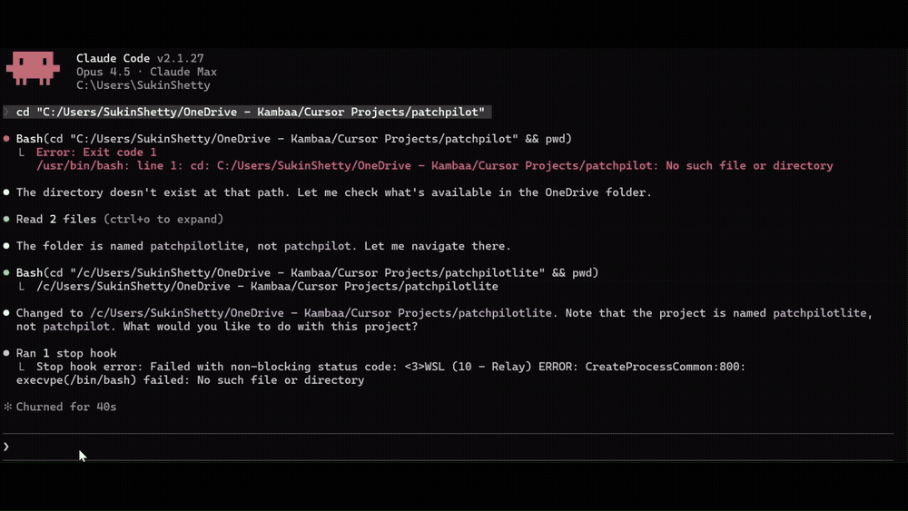
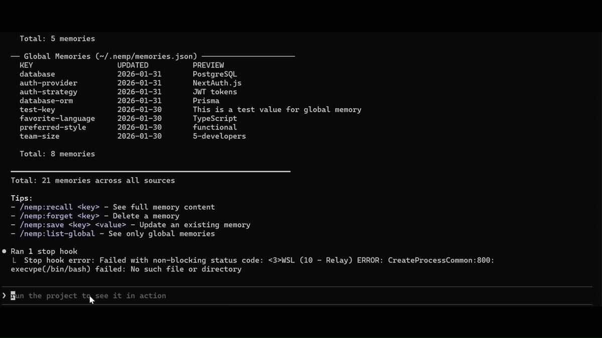
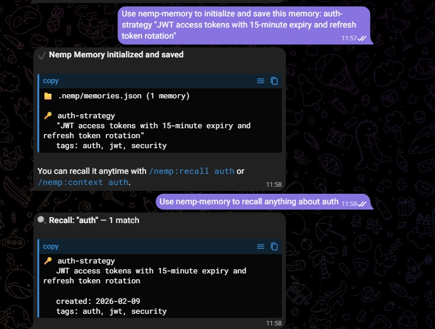

<div align="center">

  <table border="0" cellspacing="0" cellpadding="0">
    <tr>
      <td></td>
      <td><h1>&nbsp;Nemp Memory</h1></td>
    </tr>
  </table>

  <p><strong>Smart memory for AI agents — Claude Code & OpenClaw</strong></p>

  <p>
    
    
    
    
    <a href="LICENSE"></a>
    <a href="https://openclaw.ai"></a>
  </p>

  <br/>

  

</div>

---

## The Problem

Claude Code forgets everything between sessions. You waste 15-20 minutes every day re-explaining:
- Your tech stack
- Architecture decisions
- Project patterns
- What you worked on yesterday

**Other memory plugins exist, but they're complicated:**
- Require MCP servers, SQLite databases, or Ollama
- Need cloud accounts and API keys
- Send your code context to their servers
- Need 10+ steps to set up
- Come with web UIs you'll never use
- Store data in formats you can't easily read

---

## Why Nemp Is Different

**Nemp is stupidly simple:**

```bash
/plugin marketplace add https://github.com/SukinShetty/Nemp-memory
/plugin install nemp
# Done.
```

**Zero dependencies. No cloud. No API keys. Plain JSON files. Just works.**

**Cross-platform:** Works on Claude Code, OpenClaw, and any AgentSkills-compatible platform. One memory store, multiple agents.

| Feature | Other Plugins | Nemp |
|---------|---------------|------|
| **Setup** | 10+ steps | **2 commands** |
| **Dependencies** | SQLite, Ollama, web servers | **None** |
| **Cloud Required** | Often yes | **No** |
| **API Key Required** | Often yes | **No** |
| **Data Storage** | Binary databases, cloud | **Plain JSON** |
| **Privacy** | Data may leave your machine | **100% Local** |
| **Auto-detect Stack** | No | **Yes** |
| **Proactive Suggestions** | No | **Yes** |
| **Auto-sync to CLAUDE.md** | No | **Yes** |
| **Two-way CLAUDE.md sync** | No | **Yes** |
| **Conflict detection** | No | **Yes** |
| **Works Offline** | Sometimes | **Always** |
| **Cost** | Free to $19/month | **Free Forever** |

---

## What's New in v0.2.0

| Feature | Description |
|---------|-------------|
| **Agent ID Tracking** | Every memory records which agent wrote it — `main`, `nemp-init`, `backend`, etc. |
| **Access Logs** | All read/write/delete operations logged to `.nemp/access.log` with timestamps and agent names |
| **`/nemp:log` Command** | View the full audit trail. Filter by agent, tail recent entries, or clear the log |
| **Token Compression** | `/nemp:save` compresses values before storing — ~70% smaller, preserves all technical terms |
| **`/nemp:init` Optimized** | Single bash scan, reads only `package.json`, writes all memories in one operation |
| **MEMORY.md Index** | Auto-generated index at `.nemp/MEMORY.md` with agent attribution and quick overview |

---

## 6 Features That Set Nemp Apart

### 1️⃣ Auto-Init: One Command Learns Everything

**Unique to Nemp:** Auto-detects your entire stack in one command.

<p align="center">
  
</p>

```bash
/nemp:init
```

That's it. Nemp scans your project and automatically detects:
- Framework (Next.js, React, Vue, etc.)
- Language & config (TypeScript, strict mode)
- Database & ORM (Prisma, Drizzle, MongoDB)
- Auth solution (NextAuth, Clerk, Supabase)
- Styling (Tailwind, styled-components)
- Package manager (npm, yarn, pnpm, bun)

**Example output:**
```
Scanning your project...
I found:

Framework: Next.js 14 (App Router detected)
Language: TypeScript (strict mode enabled)
Database: PostgreSQL via Prisma
Auth: NextAuth.js
Styling: Tailwind CSS
Package Manager: npm

Saved 6 memories in 2 seconds
Claude now knows your stack forever.
```

**Why this matters:**
- New team members: Zero onboarding
- Context switching: Instant project recall
- No manual documentation needed

---

### 2️⃣ Smart Context: Find Memories Instantly

**Unique to Nemp:** Semantic search that understands what you're looking for.

<p align="center">
  
</p>

```bash
/nemp:context auth
```

Nemp doesn't just search for "auth" — it expands to:
- authentication, login, session, jwt, oauth, nextauth, clerk, token, passport, credentials...

**Example output:**
```
FOUND 3 MEMORIES MATCHING "auth"

auth-provider [KEY MATCH]
  NextAuth.js with JWT strategy

auth-tokens [KEY + VALUE MATCH]
  15min access tokens, 7day refresh

auth-middleware [KEY MATCH]
  Protects all /api routes except /auth/*

Quick actions:
/nemp:recall auth-provider    # View details
/nemp:context database        # Search database
```

**Why this matters:**
- No scrolling through old chats
- Context appears in < 1 second
- Finds related memories automatically

---

### 3️⃣ Memory Suggestions: AI Suggests What to Save

**Unique to Nemp:** Nemp watches your work and proactively suggests memories.

<p align="center">
  
</p>

```bash
/nemp:suggest
```

**Example output:**
```
NEMP MEMORY SUGGESTIONS
Based on your recent activity patterns:

#1  auth-approach                              PRIORITY: HIGH

DRAFTED FOR YOU:
  Authentication: JWT tokens, 15min access,
  7day refresh. Files: login.ts, session.ts,
  middleware.ts in auth/ directory

WHY SUGGESTED:
You edited 3 auth files 7+ times in 30 minutes.
This pattern is worth remembering.

[1] Save  [E] Edit  [S] Skip
```

**What it detects:**
- Files edited frequently (3+ times)
- New packages installed (npm install)
- Directory patterns (auth/, api/, components/)
- Command patterns (test before commit)
- Time-based focus (30+ min sessions)

**Why this matters:**
- Nemp drafts memories FOR you
- Zero cognitive load
- Captures patterns you'd miss

---

### 4️⃣ CLAUDE.md Auto-Sync: Set It and Forget It

**Unique to Nemp:** Your CLAUDE.md updates itself every time you save a memory.

```bash
/nemp:auto-sync on
```

That's it. From this point:

- `/nemp:save` adds a memory → CLAUDE.md updates automatically
- `/nemp:init` detects your stack → CLAUDE.md updates automatically
- `/nemp:forget` removes a memory → CLAUDE.md updates automatically

You never manually edit the project context section of CLAUDE.md again.

**What it looks like:**

```
/nemp:save testing "test-gated success with pass@k evaluation"

✓ Memory saved: testing
  Value: "test-gated success with pass@k evaluation"
  Location: .nemp/memories.json (project)
  Total memories: 12
  ✓ CLAUDE.md synced
```

Your CLAUDE.md now has two parts:
- **Top:** Your rules (written by you, never touched by Nemp)
- **Bottom:** Project context (auto-generated by Nemp, always current)

**Why this matters:**
- Two commands on day 1. Zero commands after that.
- CLAUDE.md stays accurate without you thinking about it
- New session? Claude already knows your full project context

---

### 5️⃣ Two-Way Sync: CLAUDE.md ↔ Nemp

**Unique to Nemp:** Reads FROM your CLAUDE.md and writes BACK to it.

```bash
/nemp:sync
```

**What it does:**

**Direction 1** — Imports your manually written CLAUDE.md notes into Nemp. Now those notes become searchable with `/nemp:context`.

**Direction 2** — Checks your actual project files (package.json, config files) against what CLAUDE.md says. If something doesn't match, Nemp catches it.

**Example:**

```
/nemp:sync

Imported from CLAUDE.md: 2 new memories
⚠️ Conflict: CLAUDE.md says Prisma, but package.json shows Drizzle
CLAUDE.md updated: ✓
Total memories: 15
```

**Why this matters:**
- Catches outdated context before Claude uses wrong information
- Already using CLAUDE.md? Nemp makes your existing notes searchable
- Never worry about stale project context again

---

### 6️⃣ Export to CLAUDE.md: One Command, Full Context

**Unique to Nemp:** Generates the project context section of CLAUDE.md from your saved memories.

```bash
/nemp:export
```

Nemp reads all your saved memories, organizes them by category, and writes a clean project context section into CLAUDE.md.

**Example output in CLAUDE.md:**

```markdown
## Project Context (via Nemp Memory)
> Auto-generated by Nemp Memory. Last updated: 2026-02-04 19:10

### Tech Stack
| Key | Value |
|-----|-------|
| **stack** | Next.js 15 with TypeScript |
| **database** | PostgreSQL via Drizzle |
| **auth** | NextAuth.js with JWT |
```

**Why this matters:**
- Don't want to write CLAUDE.md by hand? One command writes it for you
- Clean, organized, professional format
- Your manually written rules at the top stay untouched

---

## Cross-Provider Memory (Nemp Pro)

**Work in Claude Code, Codex, Cursor, and Windsurf — same memory, everywhere.**

Nemp Pro adds cross-provider export so your memories work in every AI coding tool. Save once in Claude Code, available everywhere.

```
Claude Code <-> .nemp/memories.json <-> Nemp Pro Export
                                             |
                                             +-- AGENTS.md ---------> Codex CLI
                                             +-- .cursor/rules/ ----> Cursor
                                             +-- .windsurfrules ----> Windsurf
```

### Setup (30 seconds)

**1. Export to your preferred tools:**

```bash
/nemp-pro:export --codex      # Generate AGENTS.md for Codex CLI
/nemp-pro:export --cursor     # Generate .cursor/rules/nemp-memory.mdc
/nemp-pro:export --windsurf   # Generate .windsurfrules
/nemp-pro:export --all        # Generate all three at once
```

**2. Enable auto-export (optional):**

```bash
/nemp-pro:auto-export on
```

Now every `/nemp:save` automatically updates all export files. Set it once, forget it.

### Provider-Specific Setup

**Codex CLI** — reads `AGENTS.md` automatically from repo root. No config needed.

**Cursor** — reads `.cursor/rules/*.mdc` files. The `alwaysApply: true` frontmatter ensures your memories are always in context.

**Windsurf** — reads `.windsurfrules` from repo root automatically.

### Bidirectional Sync

Edited memories in Codex? Import them back:

```bash
/nemp-pro:import --codex      # Import changes from AGENTS.md
/nemp-pro:import --cursor     # Import from Cursor rules
/nemp-pro:import --auto       # Detect and import from all sources
```

The import command detects new entries, shows conflicts, and asks for confirmation before updating.

### Export Status

```bash
/nemp-pro:export --status     # Check which files exist and when they were last updated
/nemp-pro:auto-export status  # Check auto-export configuration
```

---

## Installation

### Method 1: Plugin Marketplace (Recommended)

```bash
# Step 1: Add the marketplace
/plugin marketplace add https://github.com/SukinShetty/Nemp-memory

# Step 2: Install the plugin
/plugin install nemp
```

### Method 2: Windows Users (If Method 1 Fails)

Windows sometimes has issues with the marketplace command due to path handling. If you see errors like `ENOENT` or `spawn git ENOENT`, try this:

```bash
# Use the full GitHub URL directly
/plugin marketplace add https://github.com/SukinShetty/Nemp-memory.git

# Then install
/plugin install nemp
```

If that still fails, use Method 3 below.

### Method 3: Manual Installation (Git Clone)

For users who encounter persistent marketplace issues:

```bash
# Step 1: Navigate to Claude's plugins directory
cd ~/.claude/plugins/marketplaces

# Step 2: Clone the repository directly
git clone https://github.com/SukinShetty/Nemp-memory.git nemp-memory

# Step 3: Restart Claude Code
exit
claude

# Step 4: Install the plugin
/plugin install nemp
```

**Verify it's working:**
```bash
/nemp:list
```

You should see "No memories saved yet" or a list of your memories.

---

## Troubleshooting

### Commands not working?

**Step 1: Restart Claude Code**
```bash
exit
claude
```

**Step 2: Verify installation**
```bash
/plugin list
# Should show: nemp@nemp-memory
```

**Step 3: Clean reinstall**
```bash
/plugin uninstall nemp
/plugin marketplace remove nemp-memory
exit
claude
/plugin marketplace add https://github.com/SukinShetty/Nemp-memory
/plugin install nemp
exit
claude
```

### Windows Permission Error (EPERM)

If you see an error like:
```
Error: EPERM: operation not permitted, open 'C:\Users\...'
```

**What's happening:** Windows is blocking file access, often due to antivirus or file locks.

**Fix it:**

**Step 1:** Close any programs that might have the file open (VS Code, File Explorer)

**Step 2:** Run Claude Code as Administrator
- Right-click on your terminal (PowerShell/CMD)
- Select "Run as administrator"
- Try the command again

**Step 3:** If still failing, check Windows Defender
- Open Windows Security → Virus & threat protection
- Click "Manage settings" under Virus & threat protection settings
- Add your project folder to exclusions (scroll to "Exclusions")

**Step 4:** Verify it worked
```bash
/nemp:list
# Should show your memories without errors
```

---

### Commands Not Recognized

If you type `/nemp:save` and nothing happens, or you see:
```
Unknown command: nemp:save
```

**What's happening:** The plugin isn't loaded or registered properly.

**Fix it:**

**Step 1:** Check if the plugin is installed
```bash
/plugin list
```
You should see `nemp` in the list. If not, continue to Step 2.

**Step 2:** Reinstall the plugin
```bash
/plugin marketplace add https://github.com/SukinShetty/Nemp-memory
/plugin install nemp
```

**Step 3:** Restart Claude Code (required!)
```bash
exit
claude
```

**Step 4:** Verify commands are available
```bash
/nemp:list
# Should work now
```

**Still not working?** Try a clean reinstall:
```bash
/plugin uninstall nemp
/plugin marketplace remove nemp-memory
exit
claude
/plugin marketplace add https://github.com/SukinShetty/Nemp-memory
/plugin install nemp
exit
claude
```

---

### Marketplace Clone Failures

If you see errors like:
```
Error: Failed to clone marketplace repository
fatal: could not read from remote repository
```
or
```
Error: Repository not found
```

**What's happening:** Git can't access the GitHub repository.

**Fix it:**

**Step 1:** Check your internet connection
```bash
ping github.com
```

**Step 2:** Verify Git is installed
```bash
git --version
# Should show: git version 2.x.x
```

If Git isn't installed, download it from [git-scm.com](https://git-scm.com/downloads)

**Step 3:** Try cloning manually to test access
```bash
git clone https://github.com/SukinShetty/Nemp-memory.git ~/test-nemp
```

If this fails, you may have:
- Firewall blocking GitHub
- Corporate proxy issues
- GitHub rate limiting

**Step 4:** For corporate networks/proxies, configure Git
```bash
git config --global http.proxy http://your-proxy:port
```

**Step 5:** Once Git works, retry installation
```bash
/plugin marketplace add https://github.com/SukinShetty/Nemp-memory
/plugin install nemp
exit
claude
```

---

### Plugin Not Loading

If the plugin appears installed but commands don't work:
```bash
/plugin list
# Shows: nemp@nemp-memory ✓

/nemp:list
# But this does nothing or shows error
```

**What's happening:** The plugin files exist but aren't being loaded by Claude Code.

**Fix it:**

**Step 1:** Clear the plugin cache
```bash
# On Mac/Linux:
rm -rf ~/.claude/plugins/cache/nemp*

# On Windows (PowerShell):
Remove-Item -Recurse -Force "$env:USERPROFILE\.claude\plugins\cache\nemp*"
```

**Step 2:** Restart Claude Code
```bash
exit
claude
```

**Step 3:** If still not working, check for corrupted installation
```bash
/plugin uninstall nemp
/plugin marketplace remove nemp-memory
```

**Step 4:** Clear all plugin data and reinstall fresh
```bash
# On Mac/Linux:
rm -rf ~/.claude/plugins/nemp*
rm -rf ~/.claude/marketplace/nemp*

# On Windows (PowerShell):
Remove-Item -Recurse -Force "$env:USERPROFILE\.claude\plugins\nemp*"
Remove-Item -Recurse -Force "$env:USERPROFILE\.claude\marketplace\nemp*"
```

**Step 5:** Restart and reinstall
```bash
exit
claude
/plugin marketplace add https://github.com/SukinShetty/Nemp-memory
/plugin install nemp
exit
claude
```

**Step 6:** Verify everything works
```bash
/plugin list
# Should show: nemp@nemp-memory

/nemp:list
# Should show your memories (or empty list if new install)
```

---

### Uninstalling Nemp

**Remove plugin:**
```bash
/plugin uninstall nemp
/plugin marketplace remove nemp-memory
```

**Delete all data (optional):**
```bash
# Delete project memories
rm -rf .nemp

# Delete global memories
rm -rf ~/.nemp
```

**Note:** Deleting `.nemp` folders removes ALL saved memories permanently.

### Still having issues?

1. Check Claude Code version (requires v2.0+)
2. Clear cache: `rm -rf ~/.claude/plugins/cache/nemp*`
3. [Open an issue on GitHub](https://github.com/SukinShetty/Nemp-memory/issues)

---

## Quick Commands

```bash
# Get Started
/nemp:init                    # Auto-detect stack (unique!)

# Basic Memory
/nemp:save <key> <value>      # Save memory
/nemp:recall <key>            # Get memory
/nemp:list                    # List all
/nemp:forget <key>            # Delete memory

# Smart Features
/nemp:context <keyword>       # Smart search (unique!)
/nemp:suggest                 # Get AI suggestions (unique!)
/nemp:suggest --auto          # Auto-save HIGH priority

# CLAUDE.md Integration
/nemp:auto-sync on/off        # Auto-update CLAUDE.md (game changer!)
/nemp:sync                    # Two-way sync with CLAUDE.md
/nemp:export                  # Generate CLAUDE.md from memories

# Audit Trail (v0.2.0)
/nemp:log                     # View access log (reads, writes, deletes)
/nemp:log --agent backend     # Filter by agent
/nemp:log --tail 50           # Show last 50 entries

# Global (Cross-Project)
/nemp:save-global <key> <value>
/nemp:list-global

# Activity (Optional)
/nemp:auto-capture on/off     # Enable tracking
/nemp:activity                # View log
```

---

## Works on OpenClaw

Nemp Memory runs natively as an OpenClaw skill. Same persistent memory, same commands, different platform.

<p align="center">
  
</p>

### Setup (30 seconds)

**1. Copy Nemp into OpenClaw's workspace skills:**

```bash
git clone https://github.com/SukinShetty/Nemp-memory.git <your-openclaw-workspace>/skills/nemp-memory
```

Default workspace path:
- **Windows:** `C:\Users\<you>\.openclaw\workspace\skills\nemp-memory`
- **macOS/Linux:** `~/.openclaw/workspace/skills/nemp-memory`

**2. Add the SKILL.md** (required for OpenClaw to recognize the skill):

The `SKILL.md` file is included in the repo. If it's missing, create one at the root of the nemp-memory folder:

```yaml
---
name: nemp-memory
description: Persistent local memory for AI agents. Save, recall, and search project decisions as local JSON. Zero cloud, zero infrastructure.
metadata: {"openclaw": {"always": true}}
---
```

**3. Restart OpenClaw** and verify:

```
Do you see nemp-memory in your skills?
```

### That's it.

Save memories from Claude Code → recall them from OpenClaw.
Save from OpenClaw → recall from Claude Code.
Same `.nemp/memories.json`. Same commands. Zero cloud.

### Why this works

OpenClaw uses the same [AgentSkills](https://agentskills.io) standard as Claude Code. Nemp's memory commands are plain file operations on local JSON — no platform-specific APIs. If your agent can read and write files, Nemp works.

---

## Real Use Cases

### Onboarding New Developers
```bash
# Day 1, new dev runs:
/nemp:init

# Claude instantly knows:
- Tech stack
- Database setup
- Auth approach
- Project structure

Time saved: 2 hours -> 2 seconds
```

---

### Context Switching Between Projects
```bash
# Project A
cd ~/client-a
/nemp:recall stack
-> "Next.js, Stripe, PostgreSQL"

# Project B
cd ~/client-b
/nemp:recall stack
-> "React, Supabase, Tailwind"

Each project remembers itself.
```

---

### Decision History
```bash
/nemp:save api-design "RESTful not GraphQL - team decision 2024-01-15"

# 3 months later:
/nemp:context api
-> Instant recall, no Slack archaeology
```

---

## Privacy & Storage

**Everything local. No cloud. No tracking.**

```
.nemp/
  memories.json          # Your project memories
  access.log             # Read/write/delete audit trail
  config.json            # Plugin configuration
  MEMORY.md              # Auto-generated memory index
  activity.log           # Activity tracking (optional)

~/.nemp/
  memories.json          # Global memories
```

**Human-readable JSON:**
```json
{
  "key": "auth-provider",
  "value": "NextAuth.js with JWT",
  "created": "2026-01-31T12:00:00Z",
  "updated": "2026-02-11T14:00:00Z",
  "agent_id": "nemp-init"
}
```

**You own your data. Delete anytime:**
```bash
rm -rf .nemp
```

**Why privacy matters:**
- Your code contains business logic
- API keys and secrets in your context
- Competitive advantages in your architecture
- Compliance requirements (HIPAA, SOC2, etc.)

**Nemp keeps it all on your machine. Always.**

---

## Contributing

Want to add framework detection or improve suggestions?

See [CONTRIBUTING.md](CONTRIBUTING.md) for details.

**Popular requests:**
- Add Svelte/Angular detection
- Improve suggestion algorithms
- Build import/export features

---

## Support

- **GitHub Issues:** [Report bugs or request features](https://github.com/SukinShetty/Nemp-memory/issues)
- **Email:** [contact@nemp.dev](mailto:contact@nemp.dev)
- **Discord:** Coming Soon

---

## License

MIT © 2026 [Sukin Shetty](https://github.com/SukinShetty)

Open source. Free forever. Use however you want.

---

## Support This Project

**Love Nemp? Here's how you can help:**

⭐ **[Star this repo](https://github.com/SukinShetty/Nemp-memory)** – Helps other developers discover Nemp
🐛 **[Report bugs](https://github.com/SukinShetty/Nemp-memory/issues)** – Make Nemp better for everyone
💡 **Share your use case** – Tweet [@sukin_s](https://x.com/sukin_s) with #NempMemory
🔀 **[Contribute code](CONTRIBUTING.md)** – See contributing guidelines

**Join the community:**
- 💬 Discord: *Coming Soon*
- 🐦 Twitter: [@sukin_s](https://x.com/sukin_s)
- 💼 LinkedIn: [Sukin Shetty](https://linkedin.com/in/sukinshetty-1984)

**Every star motivates us to build better features!**

---

<div align="center">
  <p>Built with care by <a href="https://www.linkedin.com/in/sukinshetty-1984/">Sukin Shetty</a></p>
  <p>
    <a href="https://www.linkedin.com/in/sukinshetty-1984/">LinkedIn</a> •
    <a href="https://x.com/sukin_s">X/Twitter</a> •
    <a href="mailto:contact@nemp.dev">contact@nemp.dev</a>
  </p>
  <br>
  <p><strong>Stop repeating yourself. Start coding faster.</strong></p>
</div>
